# Curvas Parametricas

- URL: [https://www.inf.pucrs.br/pinho/CG/Aulas/Curvas/Curvas.htm](https://www.inf.pucrs.br/pinho/CG/Aulas/Curvas/Curvas.htm)
- Domínio: `www.inf.pucrs.br`
- Capturado em: `2026-09-03T15:44:53`

## Conteúdo Extraído
**Computação Gráfica**

**Curvas Paramétricas**

[Prof.Dr. Márcio Sarroglia Pinho](https://www.inf.pucrs.br/pinho)

***Introdução***

A forma mais comum de representação de curvas é aquela em que uma das coordenadas é obtida em função da outra. Ou seja, y = F(x) ou x = F(y)

Esta forma de representação, porém possui alguns inconvenientes quando estamos trabalhando com modelagem geométrica. Entre estes inconvenientes estão:

- é difícil definir a equação de uma curva através de seus pontos e de suas derivadas neste pontos (o que é bastante útil em modelagem geométrica);

[if gte vml 1]><v:shapetype id="_x0000_t75" coordsize="21600,21600" o:spt="75" o:preferrelative="t" path="m@4@5l@4@11@9@11@9@5xe" filled="f" stroked="f"> <v:stroke joinstyle="miter"/> <v:formulas> <v:f eqn="if lineDrawn pixelLineWidth 0"/> <v:f eqn="sum @0 1 0"/> <v:f eqn="sum 0 0 @1"/> <v:f eqn="prod @2 1 2"/> <v:f eqn="prod @3 21600 pixelWidth"/> <v:f eqn="prod @3 21600 pixelHeight"/> <v:f eqn="sum @0 0 1"/> <v:f eqn="prod @6 1 2"/> <v:f eqn="prod @7 21600 pixelWidth"/> <v:f eqn="sum @8 21600 0"/> <v:f eqn="prod @7 21600 pixelHeight"/> <v:f eqn="sum @10 21600 0"/> </v:formulas> <v:path o:extrusionok="f" gradientshapeok="t" o:connecttype="rect"/> <o:lock v:ext="edit" aspectratio="t"/> </v:shapetype><v:shape id="Imagem_x0020_30" o:spid="_x0000_i1053" type="#_x0000_t75" style='width:586pt;height:240pt;visibility:visible;mso-wrap-style:square'> <v:imagedata src="Curvas.fld/image003.gif" o:href="derivadas.gif"/> </v:shape><![endif]if !vml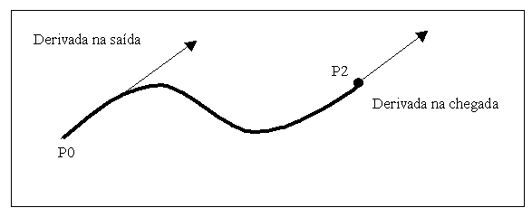endif

- é impossível criar curvas com laços;

- é bastante difícil obter uma curva suave que passe por um conjunto de pontos.

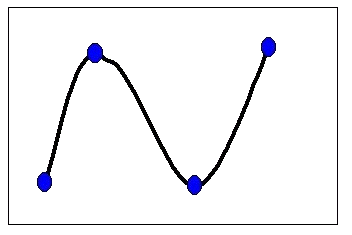

***Curvas paramétricas***

A primeira classe de curvas paramétricas é aquela em que o comportamento da curva, ao longo do tempo, em relação a cada um dos eixos é definida por uma equação independente. A forma geral destas curvas pode ser expressa por :

x = F(u) y = F(u)

Exemplos do uso desta formulação podem ser:

- Cálculo da trajetória de um projétil

A posição vertical(y) é independente da posição horizontal(x). Ambas são funções da variável "tempo".

- a equação paramétrica do círculo de raio 1 com centro na origem, para t entre 0o e 360o

x = cos(t) y = sin(t)

- a equação paramétrica do círculo de raio R com centro em (CX,CY), para t entre 0o e 360o

x = cos(t) * R + CX y = sin(t) * R + CY

- a curva

x = sen(t) y = t * t

O uso deste tipo de técnica para a criação de curvas paramétricas é bastante útil em um processo de modelagem. Porém, não soluciona dois dos problemas levantados para as curvas da forma Y = F(X):

- criação de curvas a partir dos pontos por onde ela deve passar;

- criação de curvas dados os pontos e as derivadas da curva nestes pontos.

***Composições ponderadas***

Às técnicas de obtenção de equações de curvas dados seus pontos e suas derivadas, chama-se, normalmente, **interpolação**, **aproximação** ou **composição ponderada**. Destas técnicas destacam-se 3 formulações: **curvas Bèzier, curvas Hermite e curvas Spline**.

***Curvas BÉZIER***

Analisando a equação paramétrica da reta entre os ponto P0 e P1 chega-se a conclusão de que trata-se de uma média ponderada, ou de um balanço, entre P0 e P1 onde o peso de cada ponto é definido de forma que quanto mais um deles pese no resultado, menos o outro influencie no mesmo.

 A diagram showing a line segment connecting two points, $P_0$ and $P_1$ , on a blue background. The point $P_0$ is located at the bottom left, and the point $P_1$ is located at the top right. A straight line segment connects the two points. | Point | Approximate X-coordinate (0-1000) | Approximate ](images/reta.gif)

Para obter esta ponderação os pesos de P0 e de P1 podem ser expressos pela funções (para o parâmetro ponderador "t" entre 0 e 1):

Peso de P0 = 1 - T Peso de P1 = T

Com isto a equação paramétrica da reta fica: P(t) = (1-t) * P0 + t * P1

Curvas Bèzier por 3 pontos

Caso seja preciso ponderar 3 pontos (P0, P1 e P2) gerando uma curva, a formulação é bastante semelhante:

Considerando duas retas R1 e R2, respectivamente, entre P0 e P1 e entre P1 e P2, representadas na forma paramétrica apresentada acima, é possível obter uma curva P0-P1-P2 fazendo simplesmente a ponderação entre R1 e R2 usando para isto os pesos "T" e "1 - T".

O desenvolvimento analítico desta idéia é o seguinte:

Sejam R1 e R2 as referidas retas definidas parametricamente por,

R1: (1-t) * P0 + t * P1

R2: (1-t) * P1 + t * P2

 The figure illustrates a curve $C_1$ defined by three points: $P_0$ , $P_1$ , and $P_2$ . The curve is a smooth arc connecting $P_0$ and $P_2$ , with $P_1$ positioned above the arc. The curve](images/bezier3pontos.gif)

**Exemplo de curva Bèzier por 3 pontos**

Reaplicando novamente a idéia de ponderação tem-se a curva C1 definida pela seguinte equação:

**C1 : (1-t) * R1 + t * R2**

que ao ser desenvolvida dá origem a

**C1(t) = (1-t)2 * P0 + 2 * (1-t) * t * P1 + t2 * P2**

para t entre 0 e 1.

Curvas Bèzier por 4 pontos

A obtenção das curvas Bèzier para 4 pontos (P0-P1-P2-P3) segue o mesmo raciocínio, desta feita, ponderando duas curvas, **C1**->(P0-P1-P2) e **C2**->(P1-P2-P3). O desenvolvimento desta idéia é o seguinte, com base na figura abaixo:

 The figure illustrates a curve $C_1$ and a piecewise linear path $C_2$ connecting four points $P_0, P_1, P_2,$ and $P_3$ . The points are marked with black dots. The curve $C_1$ is a smooth, thick black line that starts at $P_0$ , rises to a peak, descends ](images/DuasBz3Ptos.gif)

Dadas as curvas C1 e C2, definidas parametricamente, em função de "t", a curva C3 pode ser expressa por:

**C3 = (1-t) * C1 + t * C2**

cujo desenvolvimento resulta em

**C3(t) = (1-t)3 * P0 + 3 * t * (1-t)2 * P1 + 3 * t2 * (1-t) * P2 + t3 * P3**

 A graph illustrating a curve defined b](images/bezier4pontos.gif) **Exemplo de curva Bèzier por 4 pontos**

Formas alternativas de traçado de uma Bèzier

[if gte vml 1]><v:shape id="Imagem_x0020_33" o:spid="_x0000_i1045" type="#_x0000_t75" alt="Gráfico, Gráfico de linhas Descrição gerada automaticamente" style='width:315pt;height:131pt;visibility:visible;mso-wrap-style:square'> <v:imagedata src="Curvas.fld/image001.gif" o:title="Gráfico, Gráfico de linhas Descrição gerada automaticamente"/> </v:shape><![endif]if !vml A diagram illustrating a path or trajectory between three points: $P_0$ , $P_1$ , and $P_2$ . - $P_0$ is represented by ](images/image001.gif)endif[if gte vml 1]><v:shape id="Imagem_x0020_34" o:spid="_x0000_i1044" type="#_x0000_t75" alt="Gráfico, Gráfico de linhas Descrição gerada automaticamente" style='width:286pt;height:119pt;visibility:visible;mso-wrap-style:square'> <v:imagedata src="Curvas.fld/image002.gif" o:title="Gráfico, Gráfico de linhas Descrição gerada automaticamente"/> </v:shape><![endif]if !vml A diagram illustrating a sequence of points and their connection](images/image002.gif)endif

https://en.wikipedia.org/wiki/B%C3%A9zier_curve

Exemplos:

- Curvas Bezier e os fontes TrueType: https://jdhao.github.io/2018/11/27/font_shape_mathematics_bezier_curves/
- Editor: http://math.hws.edu/eck/cs424/notes2013/canvas/bezier.html

***Curvas HERMITE***

Tentando solucionar o problema de definição de uma curva dados seus pontos extremos e as derivadas nestes pontos surgiu a formulação de HERMITE. O desenvolvimento desta formulação vem a seguir.

Uma curva de grau 3 genérica pode ser expressa por

**P(t) = a * t3 + b * t2 + c * t + d (1)**

Se for necessário criar uma curva P(t), para t entre 0 e 1, que tenha os extremos nos pontos P0 e P3 e tenha como derivadas, nestes pontos, os vetores V0 e V3 respectivamente, tem-se como verdadeiras as seguintes definições:

**P(****0) = P0 P(1) = P3 (2)**

**P'(0) = V0 P'(1) = V3 (3)**

**P'(t) = 3 * a * t2 + 2 * b * t + c (4)**

Colocando as equações (1) e (4) na forma matricial(a fim de facilitar os cálculos) teremos:

Equação (1):

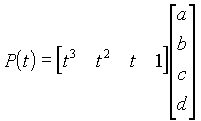

Equação (4):

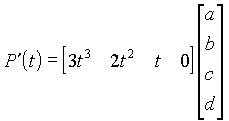

Objetivo agora é obter os valores das entradas da matriz-coluna, a qual dá-se o nome de matriz de coeficientes.

Para isto, substitui-se, nesta forma de representação, as afirmativas de (2) e (3) obtendo-se 4 equações.

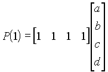 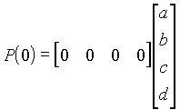

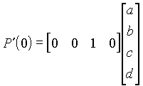 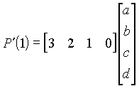

Como queremos obter os valores de 4 incógnitas (a,b,c,d) podemos colocar as 4 equações numa notação matricial:

Isolando a matriz de coeficientes(que é o objetivo deste processo) temos a seguinte equação matricial:

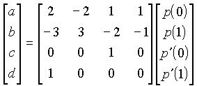

À matriz-coluna, de pontos e de derivadas dá-se o nome de matriz geometria de Hermite(MGh), e à matriz 4x4, matriz de Hermite(Mh).

Logo a equação (1)

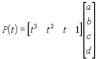

pode ser reescrita como:

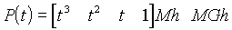

Esta equação, que ao ser desenvolvida gera:

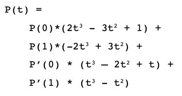

A especificação das derivadas em P0 e P3 deve ser feita através de vetores, conforme a figura abaixo.



A influência destes vetores no comportamento da curva se dá pela determinação de como a curva sai do ponto inicial e chega ao ponto final.

[if gte vml 1]><v:shape id="Imagem_x0020_1" o:spid="_x0000_i1031" type="#_x0000_t75" alt="Mapa com linhas pretas em fundo branco Descrição gerada automaticamente com confiança média" style='width:662pt;height:349pt;visibility:visible;mso-wrap-style:square'> <v:imagedata src="Curvas.fld/image004.png" o:title="Mapa com linhas pretas em fundo branco Descrição gerada automaticamente com confiança média"/> </v:shape><![endif]if !vml Diagram 1: A red curve connects node 1 to node 3. Node 1 is at the bottom left, and node 3 is at the bottom right. A vertical black line segment is drawn at node 1, extending upwards to node 2. Another vertical black line segment is drawn at node 3, extending](images/image004.png)endif

**Exemplos de Curvas Hermite**

Exemplo: https://codepen.io/liorda/pen/KrvBwr

***Curvas SPLINE***

![Image11.gif — $$p(t) = \frac{1}{6} [P_0 * (-t^3 + 3t^2 - 3t + 1) + P_1 * (3t^3 - 6t^2 + 4) + P_2 * (-3t^3 + 3t^2 + 3t + 1) + P_3 * (t^3)]$$](images/Image11.gif)

[if gte vml 1]><v:shape id="Imagem_x0020_2" o:spid="_x0000_i1028" type="#_x0000_t75" alt="Gráfico, Gráfico de linhas Descrição gerada automaticamente" style='width:685pt;height:289pt;visibility:visible;mso-wrap-style:square'> <v:imagedata src="Curvas.fld/image005.png" o:title="Gráfico, Gráfico de linhas Descrição gerada automaticamente"/> </v:shape><![endif]if !vml A rectangle with vertices labeled 1 (bottom-left), 2 (top-left), 3 (top-right), and 4 (bottom-right). A red arc is drawn above the top edge, connecting vertex 2 to vertex 3. Diagram of a rectangle with vertices labeled 1, 2, 3, 4 and a re](images/image005.png)endif

**Exemplos de Curvas Spline**

***CATMULL - ROM***

Montada a partir de uma sequência de curvas Hermite. O cálculo das tangentes de forma automática a partir dos quatro pontos fornecidos pelo usuário.

Para gerar a curva, traça-se uma Hermite entre cada par de pontos.

A curva passa pelos pontos definidos pelo usuário (menos o primeiro e o último).

[if gte vml 1]><v:shape id="Imagem_x0020_3" o:spid="_x0000_i1026" type="#_x0000_t75" alt="Gráfico, Gráfico de linhas Descrição gerada automaticamente" style='width:399pt;height:300pt;visibility:visible;mso-wrap-style:square'> <v:imagedata src="Curvas.fld/image006.png" o:title="Gráfico, Gráfico de linhas Descrição gerada automaticamente"/> </v:shape><![endif]if !vml The diagram illustrates a geometric path and its tangents. The points are arranged as follows: -](images/image006.png)endif

**Exemplo de Curva Catmull-Rom**

A tangente em cada ponto é dada por:

[if gte vml 1]><v:shape id="Imagem_x0020_4" o:spid="_x0000_i1025" type="#_x0000_t75" alt="Uma imagem contendo Texto Descrição gerada automaticamente" style='width:408pt;height:94pt;visibility:visible;mso-wrap-style:square'> <v:imagedata src="Curvas.fld/image007.png" o:title="Uma imagem contendo Texto Descrição gerada automaticamente"/> </v:shape><![endif]if !vml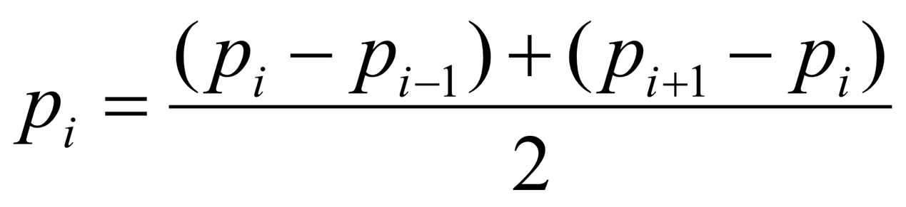endif

Vantagens

- Continuidade garantida de forma automática
- Possui a propriedade do controle local nos pontos de controle
- A curva passa pelos pontos de controle (menos o primeiro e o último)

Exemplo: https://qroph.github.io/2018/07/30/smooth-paths-using-catmull-rom-splines.html

**FIM.**
